##  1. 优化目标
### 加权Jian公平性指数
**公平性目标函数**：用$f$表示， 即
$$
f = max (F_{Jain})
$$
  其中：
  * $F_{Jain}$是Jain公平性指数，定义为：

$$
F_{\text{Jain}} = \frac{\left( \sum_{i=1}^{n} t_{ij}^{weight} \right)^2}{n \cdot \sum_{i=1}^{n} \left(t_{ij}^{weight}\right)^2}
$$
* $t_{ij}^{weight}$ 是加权响应时间，$n$ 是用户总数。

## 2. 贪心算法
### 2.1 贪心算法流程
* **初始化**用户到服务器的分配矩阵和服务器资源使用情况。
* 根据用户的**优先级从高到低**逐一分配服务器。
* 为每个用户**选择最佳的服务器**，使得**加权Jain公平性指数最大化**，同时满足服务器资源约束。
* 更新每个服务器的资源使用情况，并检查是否**满足所有约束**。
* 如果约束条件满足，返回最终的**分配矩阵**。如果多次尝试后仍无法满足约束，则跳出并警告。

### 2.2 贪心算法的主要优势
* **简单直接**：每次做出局部最优选择，因此实现起来比较直观和简单，不需要复杂的动态规划或回溯机制；
* **高效**：计算速度快，时间复杂度低。

## 3. 实验结果对比（贪心 vs 优化求解器 vs GA vs 无公平性）
* 注：
  * 无公平性的算法以最**小化平均响应时间**为优化目标
  * 因为**CPLEX**好像没法解决平方之类的**非线性问题**，优化求解换成了**Gurobi**
  
### 3.1 用户服务器分布图（150用户+20边缘服务器+3云服务器）
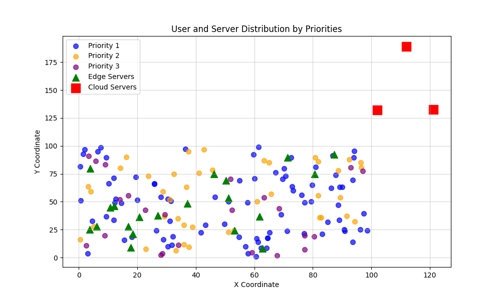

### 3.2 不同优先级用户的平均响应时间
#### 贪心
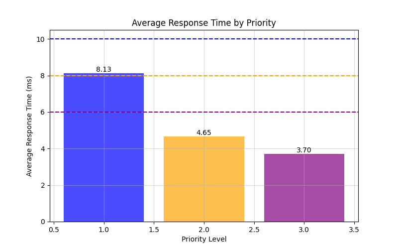

#### 优化求解器
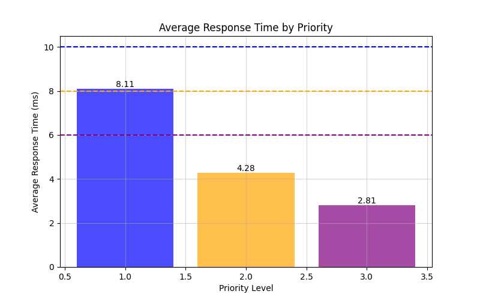

#### GA
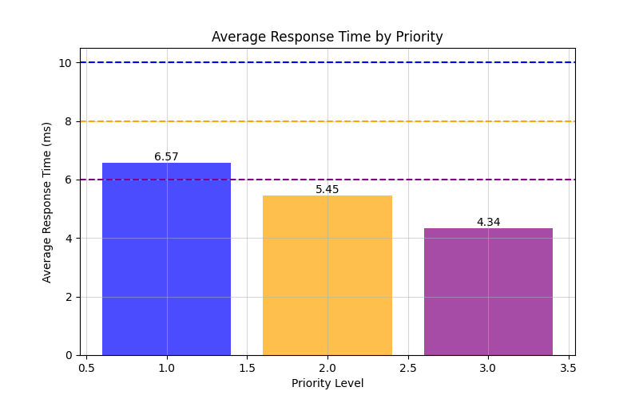

#### 无公平性
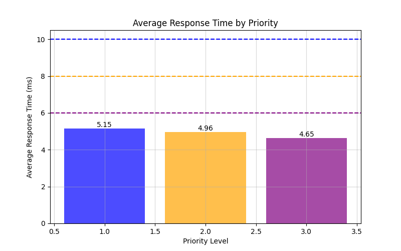

### 3.3 不同优先级用户的响应时间分布
#### 贪心
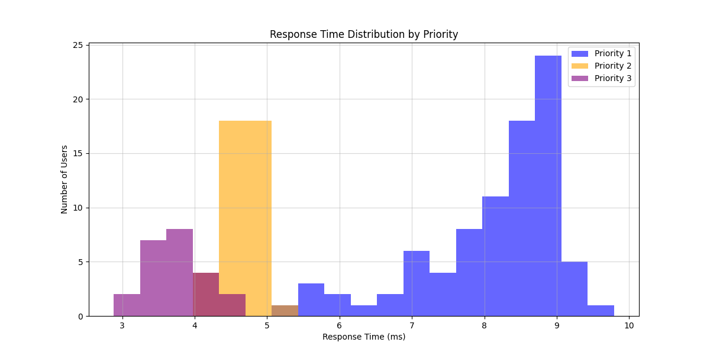

#### 优化求解器
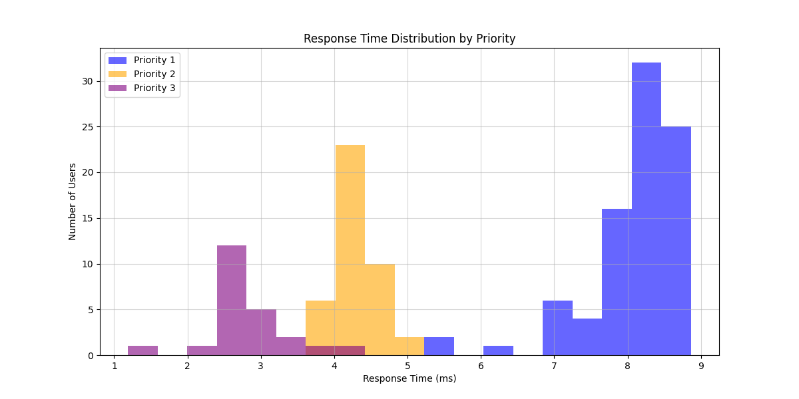

#### GA
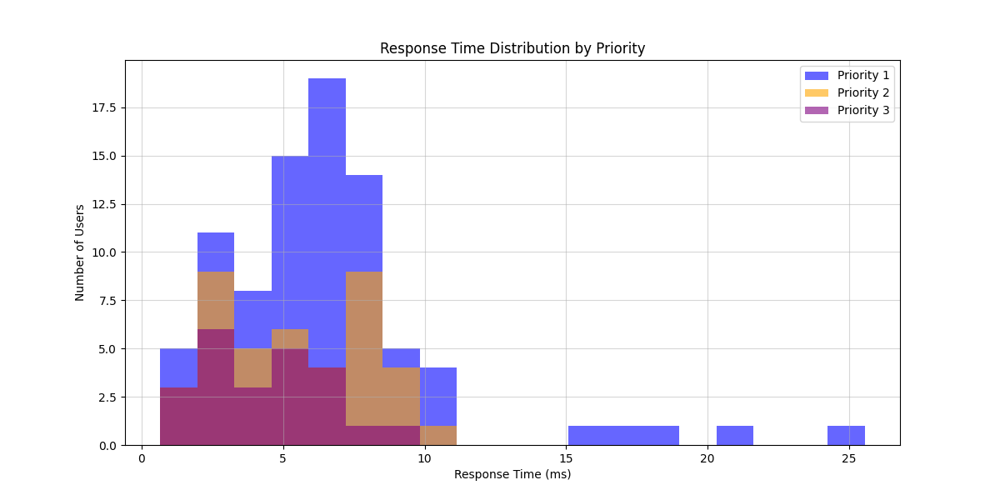

#### 无公平性
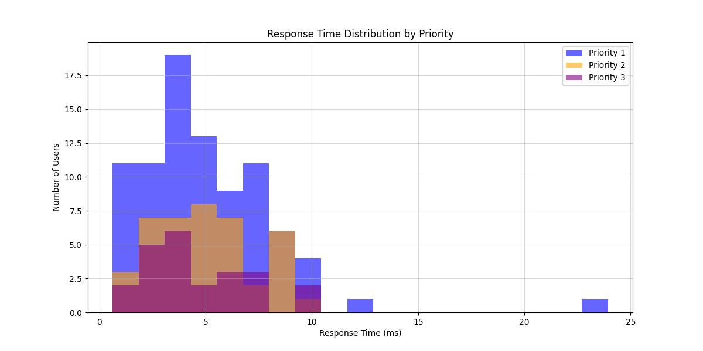

## 联合对比
#### Jain公平性指数对比
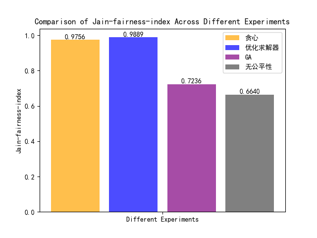
* **贪心**算法以及**优化求解器**的Jain公平性指数较高；**GA**算法次之；**无公平性**的算法Jain最低。

#### 各个优先级平均响应时间对比
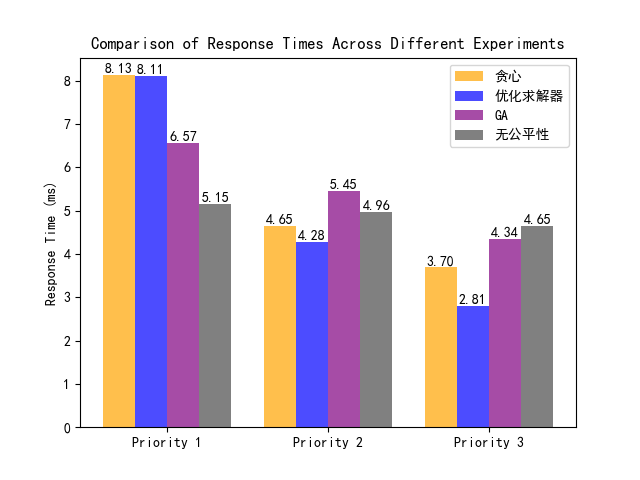
* **总体趋势**：
  * **贪心、优化求解器以及GA**算法不同优先级平均响应时间均符合**优先级越高平均响应时间越短**的趋势；
  * **无公平性**的算法则三个优先级平均响应时间**差别不大**。

* **差异分析**
  * **贪心、优化求解器**结果中**低优先级用户**响应时间较长，是因为系统**牺牲部分低优先级用户**而将**资源分配给更高优先级用户**。

