# 修改
### 1. 关于如何衡量不同优先级用户之间的公平性
* **用户自主设定**一个公平性标准，比如说**相邻**两个优先级用户之间的响应时间为：**低优先级用户的平均相应时间为高优先级用户平均响应时间的1.2-1.5倍**。
* 注：因为找不到使用加权的Jain公平性指数的相关用法，而且之前组会上也提到过没法说明加权的Jain公平性指数高就是比较公平（因为权重是自己设置的），所以决定换一个衡量标准。

### 2. 优化目标
#### 2.1 旧版--加权Jian公平性指数
**公平性目标函数**：用$f$表示， 即
$$
f = min (1 - F_{Jain})
$$
  其中：
  * $F_{Jain}$是Jain公平性指数，定义为：

$$
F_{\text{Jain}} = \frac{\left( \sum_{i=1}^{n} t_{ij}^{weight} \right)^2}{n \cdot \sum_{i=1}^{n} \left(t_{ij}^{weight}\right)^2}
$$
* $t_{ij}^{weight}$ 是加权响应时间，$n$ 是用户总数。

#### 2.2 新版--多目标优化函数

1. **响应时间比例偏差指数**：用来确保相邻优先级之间的平均响应时间符合预定的比例关系（1.2-1.5倍），所以它反映的是 **不同优先级之间的公平性**。

2. **Jain公平性指数**：这个指标反映的是 **同一优先级内部的公平性**，对于每个优先级的用户来说，响应时间越接近，Jain指数越高，越接近1，说明该优先级内部的公平性越好。

目标函数如下：

$$
\text{min} \, \left[ \lambda_1 \cdot \left( \sum_{i} \left| \frac{T_{i}}{T_{i+1}} - r \right| \right) + \lambda_2 \cdot \sum_{i} \left( 1 - F_{\text{Jain}_i} \right) \right]
$$
$T_i$ 是优先级 $i$ 的平均响应时间，$r$ 是相邻优先级的期望响应时间比 [**(1.5+1.2)/ 2**?]。  
其中：

- 第一项是响应时间比例偏差指数，衡量**不同优先级之间**的公平性。
- 第二项是Jain公平性指数，衡量**同一优先级内部**的公平性。
- $\lambda_1$ 和 $\lambda_2$ 是**权重系数**，通过调整这两个系数，在优化过程中控制优先级之间的公平性和同一优先级内部的公平性之间的权衡。

### 3. 衡量指标：

分别从**不同的维度**衡量公平性，一个是**不同优先级之间**的公平性（通过响应时间比例偏差指数），另一个是**同一优先级用户内部**的公平性（通过Jain公平性指数）。

#### 3.1 响应时间比例偏差指数（越小越好）
（**衡量不同优先级用户之间的响应时间比例是否符合用户设置的公平时间比例**）
$$
  \sum_{i} \left| \frac{T_{i}}{T_{i+1}} - r \right| （响应时间比例偏差指数）
$$
其中，$T_i$ 是优先级 $i$ 的平均响应时间，$r$ 是相邻优先级的期望响应时间比（1.2-1.5）。  
* 这个指标是计算每一对相邻优先级用户响应时间比与期望响应时间比的偏差，并求取它们的绝对值之和。
* **目标**：该指标**越小**，说明相邻优先级用户之间的响应时间比越符合客户设定的范围（1.2-1.5倍）。如果某一对优先级之间的响应时间比偏离了期望的比例，那么这个偏差就会增加。

#### 3.2 Jain公平性指数
(**衡量同一优先级用户之间响应时间的公平性，$F_{\text{Jain}_i}$ 越趋近于1，说明优先级 $i$ 的用户越公平**)
$$
  F_{\text{Jain}_i} = \frac{\left( \sum_{i=1}^{n_i} t_{ij} \right)^2}{n_i \cdot \sum_{i=1}^{n_i} \left(t_{ij}\right)^2}
$$
* $t_{ij}$ 是响应时间，$n_i$ 是优先级为 $i$ 用户总数。

# 实验结果
**NSGA - II vs 公平性GA vs MILP vs 无公平性-（优化目标是最小化平均响应时间）**

## 1. 用户服务器分布图（150用户+20边缘服务器+3云服务器）
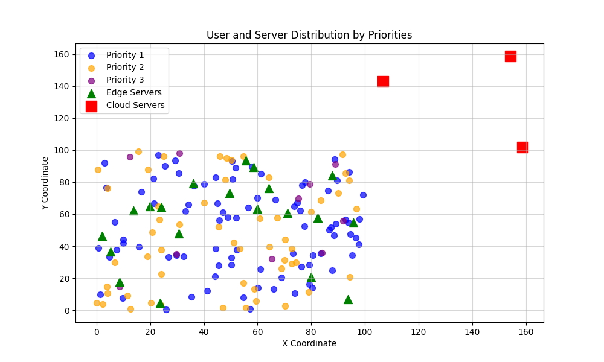

## 2. 三组实验结果对比 
### 2.1 不同优先级用户的平均响应时间
#### NSGA - II

#### 公平性GA
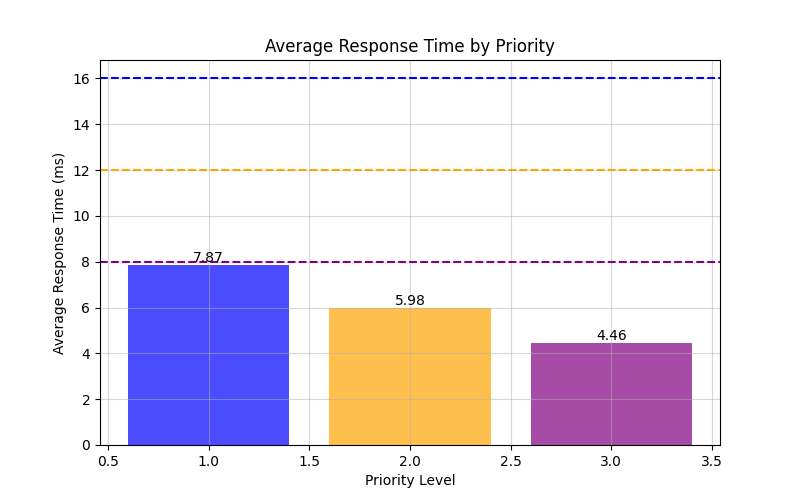

#### MILP（CPLEX）
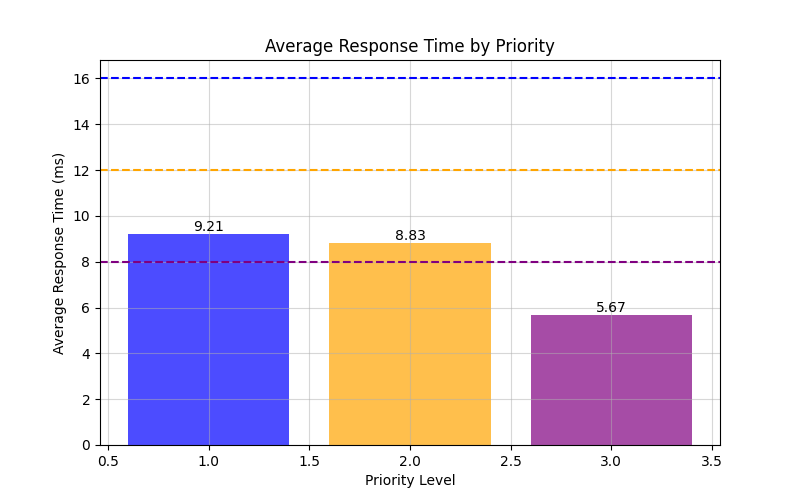

#### 无公平性
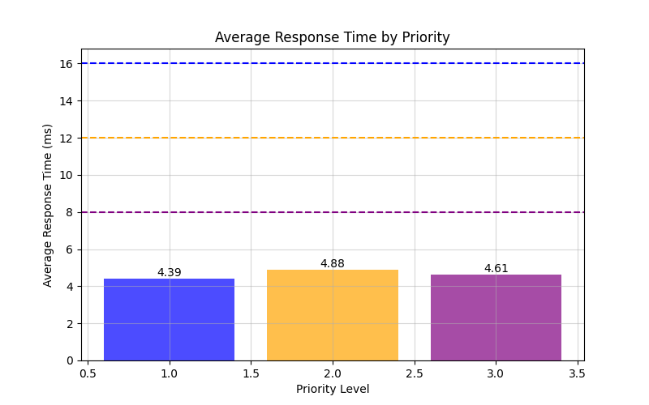

### 2.2 不同优先级用户的响应时间分布
#### NSGA - II
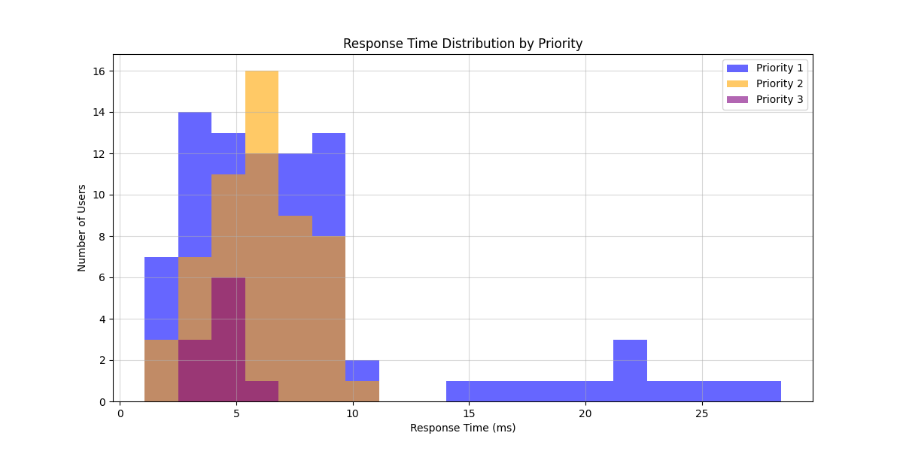

#### 公平性GA
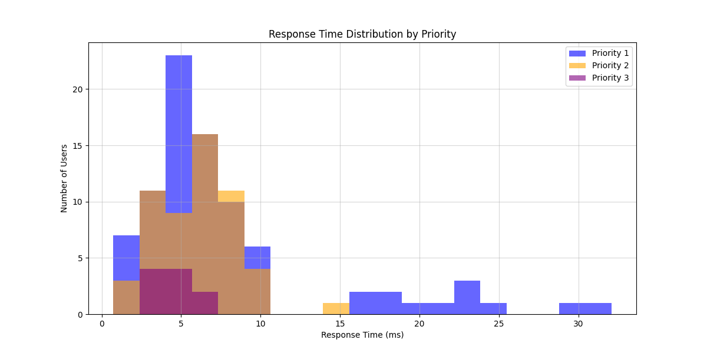

#### MILP（CPLEX）
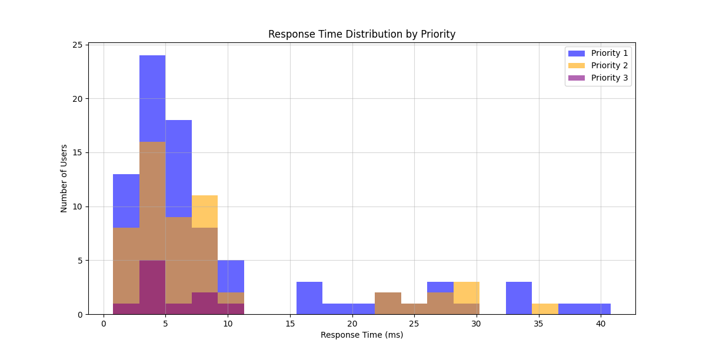

#### 无公平性
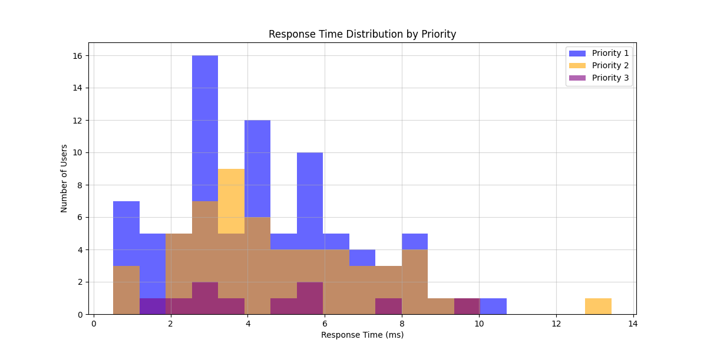

### 2.3 最终用户与服务器连接图
#### NSGA - II
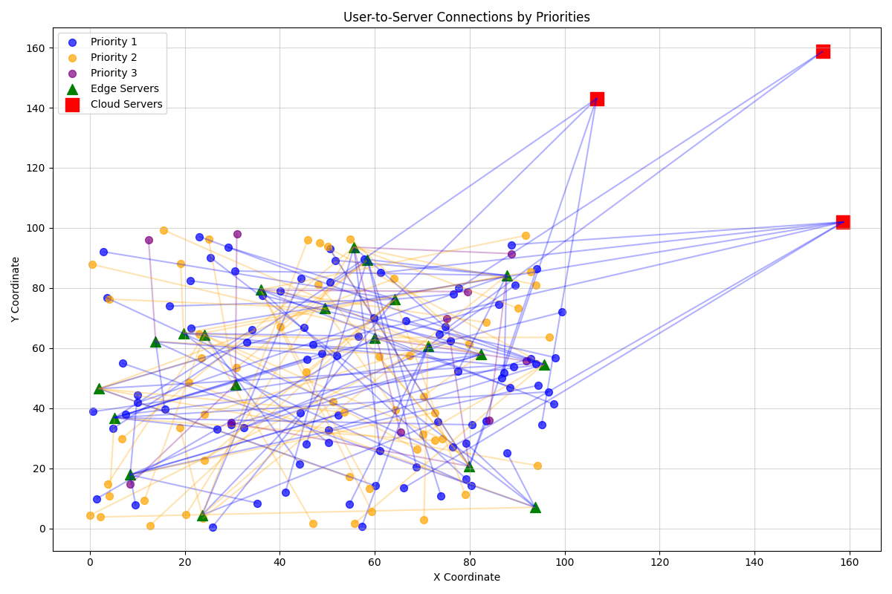

#### 公平性GA
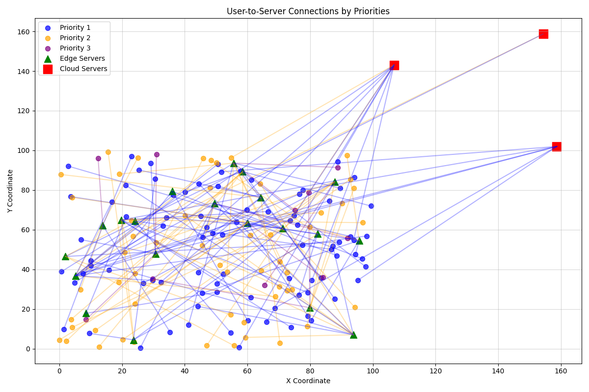

#### MILP（CPLEX）
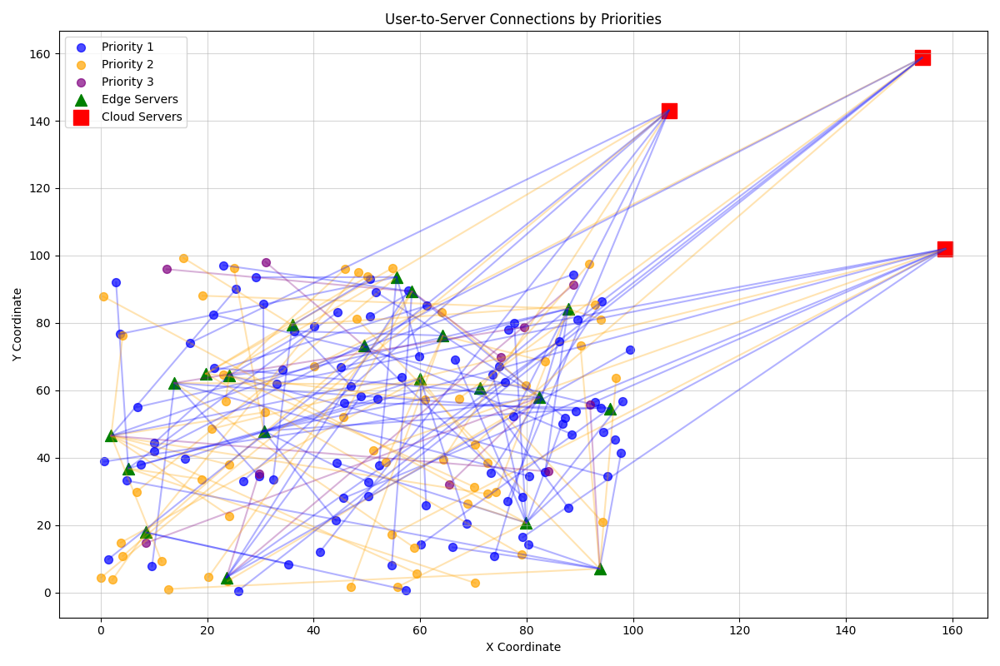

#### 无公平性
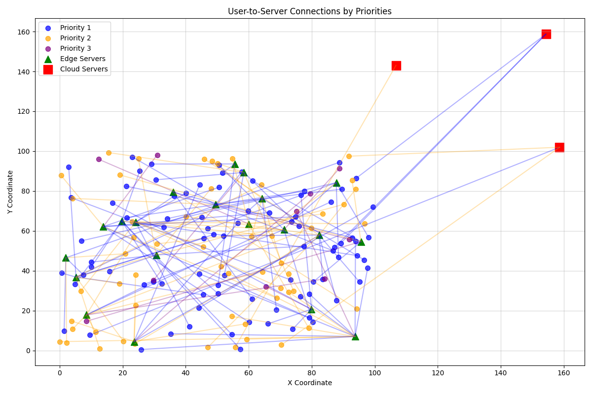

### 2.4 公平性GA的适应度、各优先级Jain公平性指数、响应时间比例偏差指数变化图
#### 适应度变化 
(取目标函数的**相反数**，这样就是适应度逐渐变大)
$$
-\left[ \lambda_1 \cdot \left( \sum_{i} \left| \frac{T_{i}}{T_{i+1}} - r \right| \right) + \lambda_2 \cdot \sum_{i} \left( 1 - F_{\text{Jain}_i} \right) \right]
$$
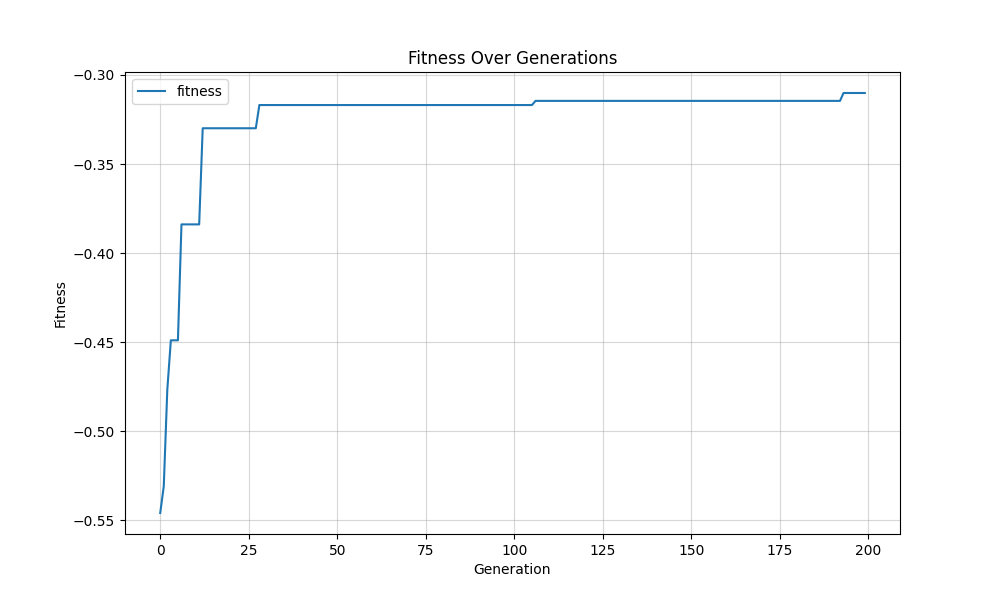

#### 各优先级Jain公平性指数变化

$$
  F_{\text{Jain}_i} = \frac{\left( \sum_{i=1}^{n_i} t_{ij} \right)^2}{n_i \cdot \sum_{i=1}^{n_i} \left(t_{ij}\right)^2}
$$
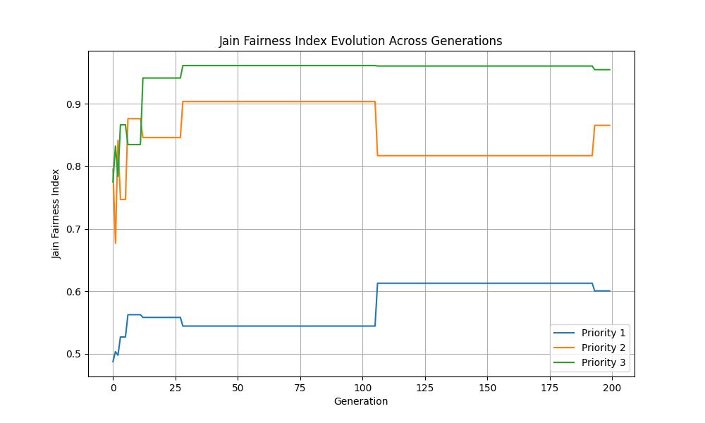

#### 响应时间比例偏差指数变化
$$
  \sum_{i} \left| \frac{T_{i}}{T_{i+1}} - r \right| （响应时间比例偏差指数）
$$
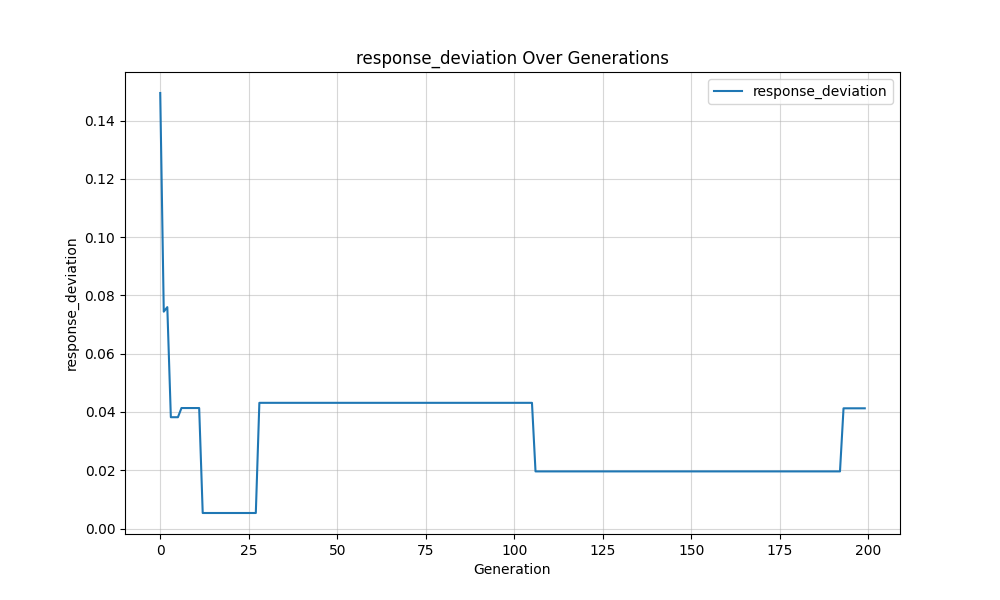

### 2.5 具体数据结果
#### NSGA - II  
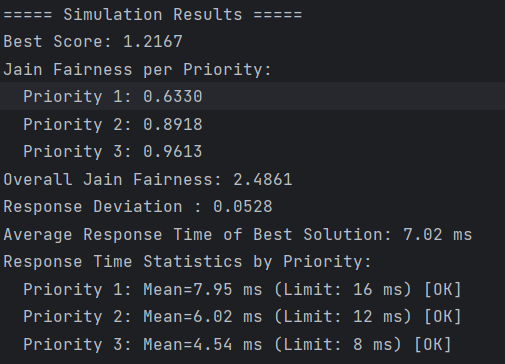  

#### 公平性GA
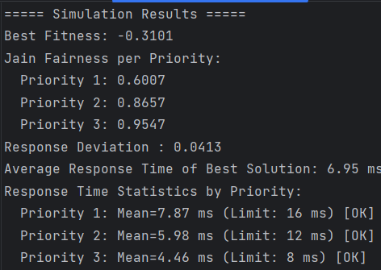  

#### MILP（CPLEX）
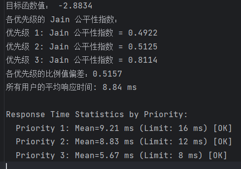  

#### 无公平性
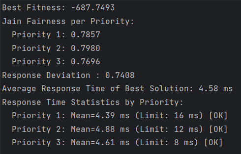  

## 联合对比
#### 平均响应时间对比
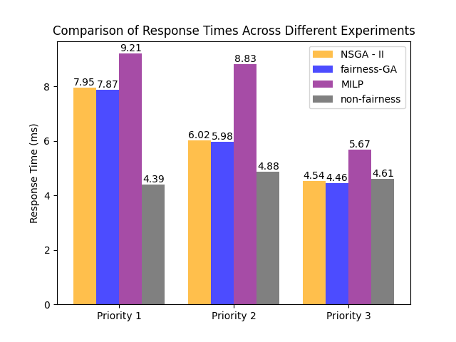
* **整体趋势**：前三组引入公平性的实验随着**优先级从1升高到3**，平均响应时间总体呈**下降**趋势，符合预期结果；
* **各算法表现**：**NSGA - II** 和 **fairness-GA** 平均响应时间相对较低；**non-fairness**并未引入公平性，其优化目标是最小化平均响应时间，所以其各个优先级的平均响应时间都较短。

#### Jain公平性指数对比
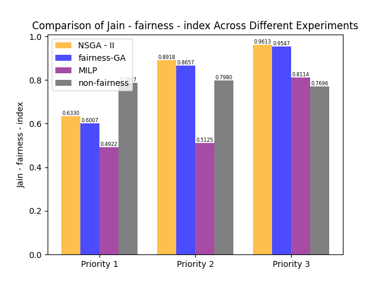
* **NSGA - II** 和 **fairness - GA**的公平性指数较高，说明其同一优先级内个用户的响应时间相近，公平性较好。

#### 响应时间比例偏差指数对比
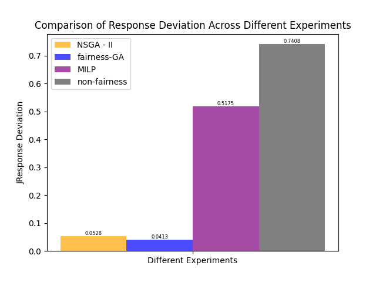
* **non - fairness**的响应时间比例偏差指数远高于 **NSGA - II** 和 **fairness - GA**，**MILP**介于中间，即 **NSGA - II** 和 **fairness - GA** 在不同优先级之间的公平性表现较好。

#### 自己的算法？

* 不太有思路，看了一些论文，但是也不太知道怎么下手
