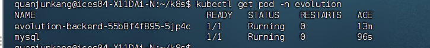
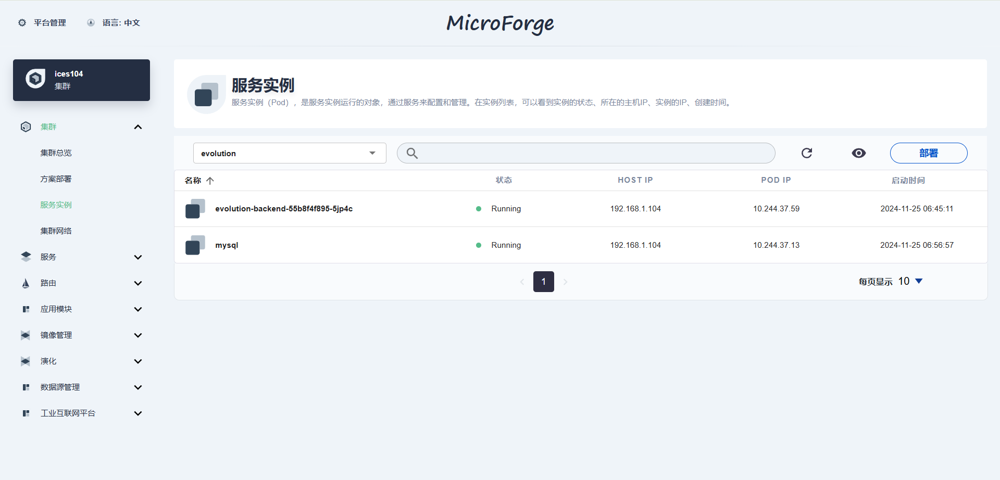

## 1. 个人
### 1.1 建模修改
1. 建模引入**用户优先级 $Q_i$**：优先级越高的用户平均响应时间应该越短。
2. 引入**用户权重 $W_i$**：不同优先级 $Q_i$ 对应着不同权重，**用户优先级越高，其权重越大**，代表其响应时间对系统整体的平均响应时间影响越大。
3. 更改**公平性目标函数**改为：
    $$
    f = min (1 - F_{Jain})
    $$

    * 其中$F_{\text{Jain}}$ 为Jain公平性指数，计算如下：
    $$
    F_{\text{Jain}} = \frac{\left( \sum_{i=1}^{n} t_{ij}^{weight} \right)^2}{n \cdot \sum_{i=1}^{n} \left(t_{ij}^{weight}\right)^2}
    $$
    * $t_{ij}^{weight}$ 为用户 $u_i$ 的加权响应时间：
    $$
    t_{ij}^{weight} = t_{ij} \cdot W_i 
    $$

### 1.2 QoE vs QoS
用QoE话还需要加入什么衡量指标么？  
响应时间、内容质量（清晰度/分辨率）

### 1.3 动态用户请求
目前假设用户请求大小 $D_i$ 是固定值，可以扩展为动态特性。例如，用户请求可以随着时间波动，模拟实际场景中的**高峰期和低谷期**。
- 用时间序列或概率分布模拟动态的 $D_i(t)$。
- 引入时间片的概念，将一天划分为多个时间段，分别优化每个时间段的部署策略。

### 1.4 优化算法改进方法
1. 不同优先级用户的**平均响应时间限制**要分开设置么？
2. 使用混合优化算法？
3. 动态调整遗传参数--前期交叉变异概率较高，增强全局探索；后期降低概率，局部搜索

## 2. 大三竞赛  
1. 后端已部署，暴露端口为30030，现在运行在主机104上，http://100.105.103.116:30030/；
   
      

    

2. 但是由于还不知道kubesphere的密码，跟k8s-api的交互相关的功能可能有点问题，不涉及与k8s的交互的功能是能够正常使用的。
