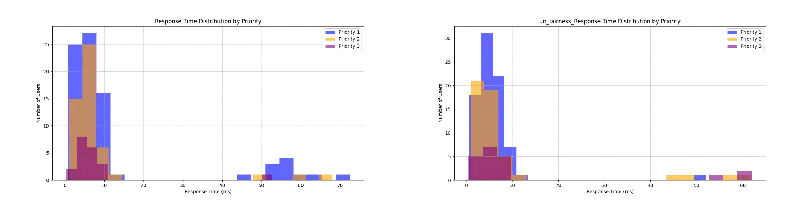

## 1. 个人
### 1.1 给不同优先级用户不同响应时间限定
为每个优先级类别的用户设定一个不同的**最大允许的平均响应时间**:  

$$
\frac{1}{|U_{Q_i}|} \sum_{u_j \in U_{Q_i}} \sum_{s_k \in S} x_{jk} \cdot t_{jk} \leq T_{Q_i}^{max}, \quad \forall Q_i
$$
$T_{Q_i}^{max}$ 是优先级类别 $Q_i$ 的最大响应时间上限。这个约束确保每个优先级类别的用户响应时间不会超过设定的上限。

### 1.2 引入公平性之后的影响对比，正面还是负面？
#### a. 引入公平性的目标函数：最大化 Jain 公平性指数
$$
  f = min (1 - F_{Jain})
$$

  * $F_{Jain}$ 是Jain公平性指数，定义为：
$$
  F_{\text{Jain}} = \frac{\left( \sum_{i=1}^{n} t_{ij}^{weight} \right)^2}{n \cdot \sum_{i=1}^{n} \left(t_{ij}^{weight}\right)^2}
$$  

  * $t_{ij}^{weight}$ 是加权响应时间：$t_{ij}^{weight} = t_{ij} \cdot W_i$ 
  * $n$ 是用户总数。  
  

#### b. 不引入公平性的目标函数：最小化总响应时间
$$
f = min \sum_{i=1}^{n} \sum_{j=1}^{m} x_{ij} \cdot t_{ij}
$$

#### c. 考虑公平性 VS 不考虑公平性
* **用户与服务器分布**：
  * 用户：150；
    * Priority 1: 80 users
    * Priority 2: 50 users
    * Priority 3: 20 users
  * 边缘服务器：20；
  * 云服务器：3  

* **用户与服务器连接情况（公平性 VS 无公平性）**
  * **引入公平性**： 用户的连接情况相对均衡，边缘服务器的负载更加分散，这有助于避免某些服务器的过载。
  * **不引入公平性**： 部分服务器的负载可能偏高，尤其是边缘服务器，而云服务器的负载较低。通过不考虑公平性，优化可能会倾向于优先将用户分配给当前响应最快的服务器，忽略了整体公平性。  

   

* **平均响应时间（公平性 VS 无公平性）**
  * **引入公平性**： 10.87 ms
  * **不引入公平性**： 7.62 ms
  * 引入公平性后，为了实现更公平的服务质量，平均响应时间有所增加。  

* **不同优先级用户的响应时间分布（公平性 VS 无公平性）**
  * **引入公平性**：   
    Priority 1: Mean=12.95 ms (Limit: 30 ms)   
    Priority 2: Mean=8.73 ms (Limit: 15 ms)     
    Priority 3: Mean=7.86 ms (Limit: 10 ms)     
  * **不引入公平性**：   
    Priority 1: Mean=5.78 ms (Limit: 30 ms)   
    Priority 2: Mean=8.40 ms (Limit: 15 ms)   
    Priority 3: Mean=13.02 ms (Limit: 10 ms)   
  * 公平分配确保了高优先级用户获得优先响应，从而提升了服务质量的均衡性。  

* **边缘服务器资源利用率（公平性 VS 无公平性）**
  * **CPU平均利用率**：
    * **引入公平性**： 63.8%
    * **不引入公平性**： 66.8%  
  

  * **内存平均利用率**：
    * **引入公平性**： 66.0%
    * **不引入公平性**： 70.8%  
  

  * **带宽平均利用率**：
    * **引入公平性**：59.7%
    * **不引入公平性**：62.5%  
  

  * **即**：引入公平性后，边缘服务器的资源利用率（CPU、内存、带宽）较低，因为系统可能会牺牲一些资源利用效率以确保公平性。
  

* **部署成本（公平性 VS 无公平性）**
  * **引入公平性**：444.27(Units)
  * **不引入公平性**：401.27(Units)
  * 引入公平性后，部署成本较高，反映了为了确保公平性，可能需要更多的资源来维持服务质量和均衡。  
  

* **总结**：
  * **引入公平性**：有助于**优化不同用户间的响应时间差异**，避免了某些用户响应时间过长的问题，保障了服务的公平性。但由于资源更加均衡分配，整体的**平均响应时间可能增加**、**资源利用率可能会下降**，导致**部署成本上升**。
  * **不引入公平性**：可以更好地优化总响应时间，减少平均响应时间，但会导致不同用户间的服务质量差异较大，影响整体的公平性。

### 1.3 优化？

#### Jain公平性指数变化情况
 

* **优先级加权分配**？  （采用）  
  进一步细化优先级控制，为高优先级用户（如Priority 3）分配更多的带宽、CPU 和内存资源。根据用户的响应时间要求（如限制在10ms以内），进行资源加权调整。

* 调整**服务实例部署策略**？  （采用）  
  采用基于网络拓扑优化的算法来确保用户连接到**最近、负载较低**的服务器实例。

* **提高公平性和响应时间的平衡**？  （没必要）  
  在目标函数中加入 **公平性** 和 **响应时间** 的组合目标函数，使得在优化Jain公平性时，不至于牺牲过多的响应时间。
  $$
  f = \alpha \cdot (1 - F_{\text{Jain}}) + \beta \cdot \sum_{i=1}^{n} \sum_{j=1}^{m} x_{ij} \cdot t_{ij}
  $$
  其中，$\alpha$和 $\beta$ 是调整公平性与响应时间之间平衡的权重系数。

## 2. 大三竞赛
### 2.1 文档材料
**项目计划书**，其中必须包含以下内容  **（大概要写多少字？）**
- 项目概述（背景、目的、创新点） 
- 技术方案（总体架构、功能概述、关键技术、其他技术等）
-  项目计划（可行性分析、排期规划）

## 改进
* 新的指标？--让优化明显一点
* 贪婪
* 最优化求解器
* 约束都加上做一下
