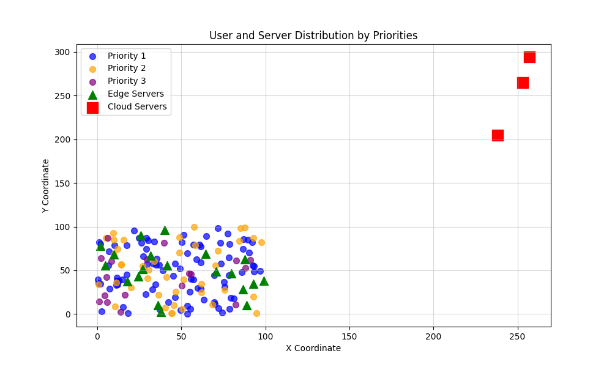
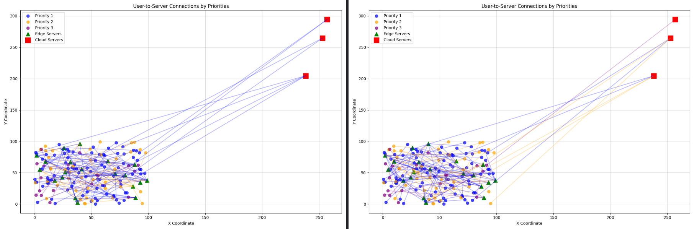
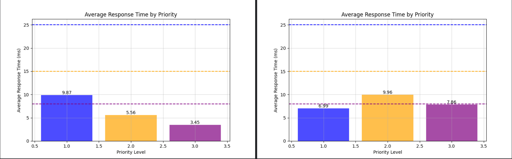
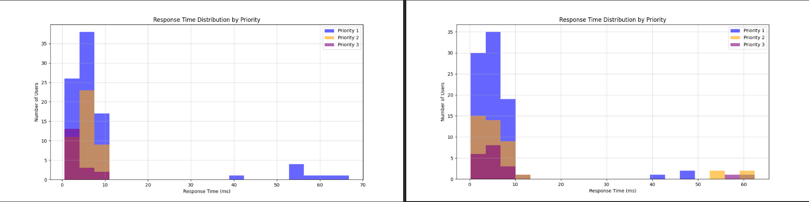
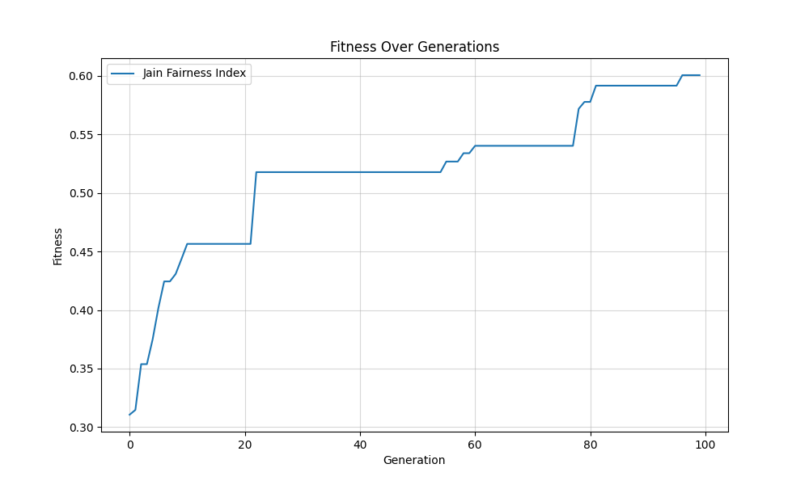
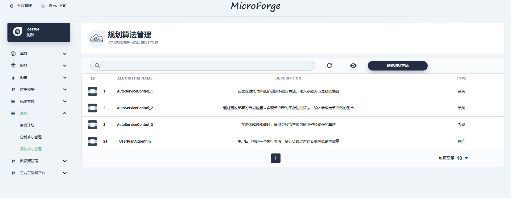

# 1. 个人
## 1.1 提高Jain公平性指数
### 1.1.1 修改建模
#### a. 高优先级用户在服务器上获取更多资源
**计算资源分配 $R_{i}$**  
用 $R_{i}$ 表示用户 $u_i$连接到服务器 $s_j$时，服务器需要分配的资源来处理请求。**资源分配集合** $R_{i}$ 可定义为：
$$
R_{i} = \{r_{i}^{cpu}, r_{i}^{mem}, r_{i}^{b},  \cdots \}
$$

其中：  
$$
\left\{
\begin{array}{l}
r_{i}^{cpu} \text{ 表示用户 } u_i \text{ 连接到服务器 } s_j \text{ 时服务器分配给该用户的 CPU 资源量, } r_{i}^{cpu} = f_{cpu}(D_i) \cdot L_i \\
r_{i}^{mem} \text{ 表示用户 } u_i \text{ 连接到服务器 } s_j \text{ 时服务器分配给该用户的 内存 资源量, } r_{i}^{mem} = f_{mem}(D_i) \cdot L_i \\
r_{i}^{b} \text{ 表示用户 } u_i \text{ 连接到服务器 } s_j \text{ 时服务器分配给该用户的 带宽 资源量, } r_{i}^{b} = f_{b}(D_i) \cdot L_i
\end{array}
\right.
$$

* $L_i$ 是用户的**资源分配优先级系数**，通过用户优先级调整服务器分配给用户的资源量；**优先级较高的用户**（具有较大的 $L_i$），将获得**更多**的资源，即获得的**处理能力更强**，在数据请求量相同时有**更短**的**处理延迟**。

* $D_i$ 是用户 $u_i$ 的**数据请求量**；
* $f_x(D_i)$ 为用户数据请求量 $D_i$ 与 **CPU、内存以及带宽** 等资源分配量的转换函数；

#### b. 服务器处理速率与资源分配
  用户 $u_i$ 连接到服务器 $s_j$ 时，服务器分配给用户的**资源量**决定了服务器对该用户请求的**处理能力**：
  $$
  P_{ij}^x = (\frac{R_i}{\sum_{u_k \in U}{R_k}}) \cdot P_j^x , x_{kj} = 1
  $$
  * **$P_{ij}^x$**：表示服务器 $s_j$ 分配给**用户** $u_i$ 的**计算能力**，其中 $x$ 可以是 `e` 或 `c`，分别代表边缘服务器和云服务器。
  
  * **$P_j^x$**：表示服务器 $s_j$ 的**总处理能力**，对于边缘服务器是 $P_j^e$，对于云服务器是 $P_j^c$。（通常情况下，$P_j^e < P_j^c$）

  * **$\frac{R_i}{\sum_{u_k \in U}{R_k}}$**：表示用户 $u_i$ 在服务器 $s_j$ 上所**分配的资源量** $R_i$ 与该服务器上**所有用户** $u_k$ 分配的**资源总和**的比例。

  * 通过比例分配，每个用户获得的**计算能力**是与其**分配的资源量**成**正比**的。

### 1.1.2 更改变异操作 
* **优先级更高**的用户在进行**变异**时，有更高的概率变异到**边缘服务器**上。
  

## 1.2 相同约束条件下对比（公平性 VS 无公平性）
#### a. 引入公平性的目标函数：最大化 Jain 公平性指数
$$
  f = min (1 - F_{Jain})
$$

  * $F_{Jain}$ 是Jain公平性指数，定义为：
$$
  F_{\text{Jain}} = \frac{\left( \sum_{i=1}^{n} t_{ij}^{weight} \right)^2}{n \cdot \sum_{i=1}^{n} \left(t_{ij}^{weight}\right)^2}
$$  

  * $t_{ij}^{weight}$ 是加权响应时间：$t_{ij}^{weight} = t_{ij} \cdot W_i$ 

#### b. 不引入公平性的目标函数：最小化总响应时间
$$
f = min \sum_{i=1}^{n} \sum_{j=1}^{m} x_{ij} \cdot t_{ij}
$$

#### c. 考虑公平性 VS 不考虑公平性
* **用户与服务器分布**：
  * 用户：150；
    * Priority 1：89  users
    * Priority 2：43 users
    * Priority 3：18  users
  * 边缘服务器：20；
  * 云服务器：3  

* **用户与服务器连接情况（公平性 VS 无公平性）**

* **不同优先级用户的响应时间分布（公平性 VS 无公平性）**
  * **引入公平性**：   
    Priority 1: Mean= 9.87ms (Limit: 25 ms)   
    Priority 2: Mean= 5.56ms (Limit: 15 ms)     
    Priority 3: Mean= 3.45ms (Limit: 8 ms)     
  * **不引入公平性**：   
    Priority 1: Mean= 6.99ms (Limit: 25 ms)   
    Priority 2: Mean= 9.96ms (Limit: 15 ms)   
    Priority 3: Mean= 7.86ms (Limit: 8 ms) 

* **Jain公平性指数变化情况**
  * Best Fitness (Jain Fairness Index): 0.6006
  
# 2. MicroForge
* 已把**演化部分**前端整合到平台。  
* 进行了相应的页面调整。

# 3. 大三竞赛
### 撰写项目计划书
* 传到飞书文档 https://scn0zgiqxt1u.feishu.cn/wiki/GjcawWpyYiaLDKk0NZ1cAxiRnLh?from=from_copylink
