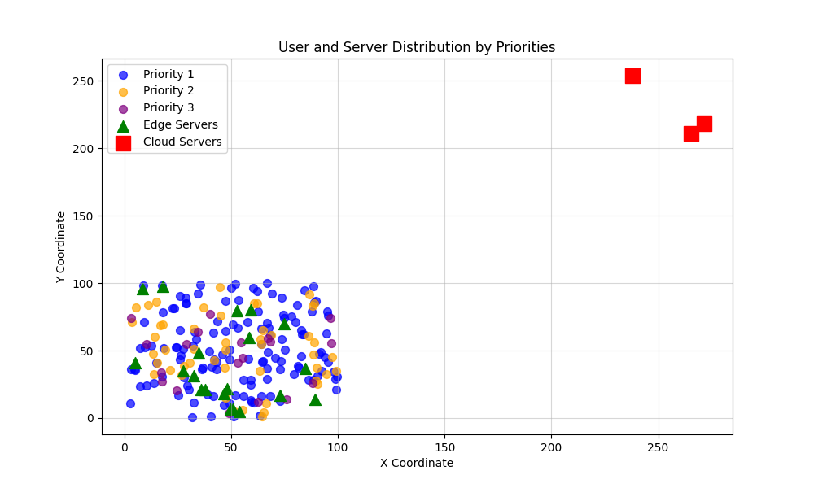
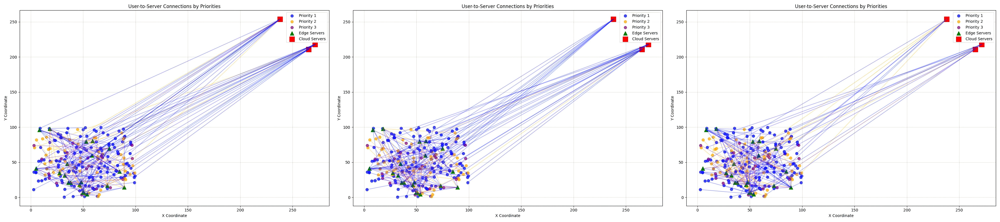
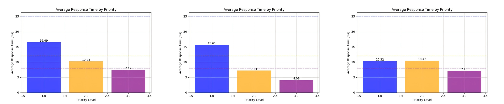
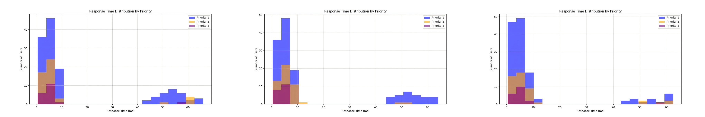
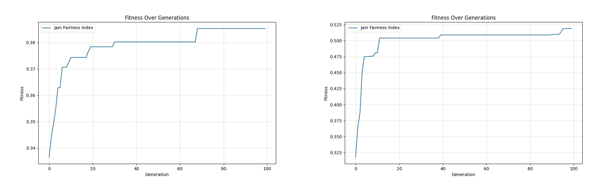
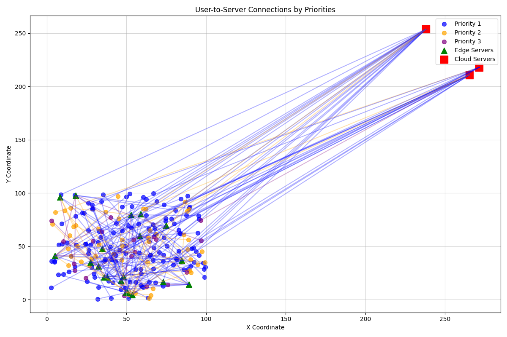
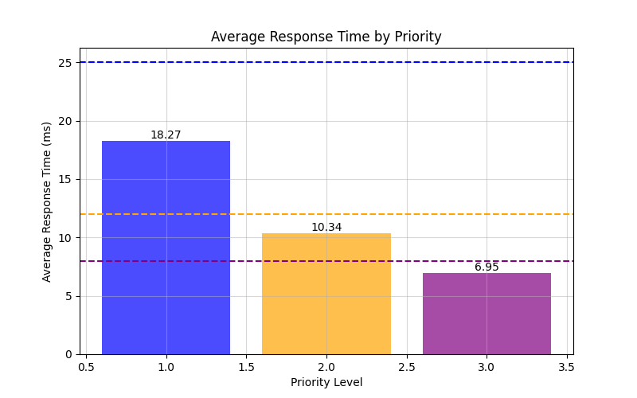
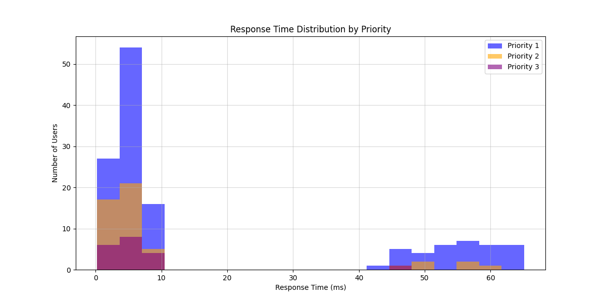

# 1. GA算法

### 1.1 实验对比
### （公平性但资源分配均等）  VS  （公平性+按用户优先级资源分配）  VS  （无公平性）
### 第一、二组：
**a. 引入公平性的目标函数：最大化 Jain 公平性指数**
$$
f = min (1 - F_{Jain})
$$

  * $F_{Jain}$ 是Jain公平性指数，定义为：
$$
F_{\text{Jain}} = \frac{\left( \sum_{i=1}^{n} t_{ij}^{weight} \right)^2}{n \cdot \sum_{i=1}^{n} \left(t_{ij}^{weight}\right)^2}
$$

  * $t_{ij}^{weight}$ 是加权响应时间：
    $$
    t_{ij}^{weight} = t_{ij} \cdot W_i
    $$
    

**b. 资源分配系数 $L_i$ 的设置：**  
$$
priority\_levels_1 = \{1： 1,\quad 2： 1,\quad 3： 1\}
$$
$$
priority\_levels_2 = \{1： 1,\quad 2： 2,\quad 3： 3\}
$$
### 第三组：不考虑公平性
#### 不引入公平性的目标函数：最小化总响应时间
$$
f = min \sum_{i=1}^{n} \sum_{j=1}^{m} x_{ij} \cdot t_{ij}
$$

### 1.3 实验结果
### （公平性但资源分配均等）  VS  （公平性+按用户优先级资源分配）  VS  （无公平性）
* **用户与服务器分布**：
  * 用户：200；
    * Priority 1: 132 users
    * Priority 2: 49 users
    * Priority 3: 19 users
  * 边缘服务器：20；
  * 云服务器：3 
  

* **用户与服务器连接情况**

* **不同优先级用户的响应时间分布**  
  *  **资源分配系数为：1：1：1（即不同优先级用户资源分配情况相同）**  
    Priority 1: Mean=16.49 ms (Limit: 25 ms) [OK]  
    Priority 2: Mean=10.25 ms (Limit: 12 ms) [OK]  
    Priority 3: Mean=7.47 ms (Limit: 8 ms) [OK]      
    *平均响应时间：**14.10**ms*
  
  *  **资源分配系数为：1：2：3（即高优先级用户分配更多资源）**  
    Priority 1: Mean=15.61 ms (Limit: 25 ms) [OK]  
    Priority 2: Mean=7.24 ms (Limit: 12 ms) [OK]  
    Priority 3: Mean=4.08 ms (Limit: 8 ms) [OK]   
    *平均响应时间：**12.47** ms*

  * **不引入公平性**       
    Priority 1: Mean=10.32 ms (Limit: 25 ms) [OK]  
    Priority 2: Mean=10.43 ms (Limit: 12 ms) [OK]  
    Priority 3: Mean=7.13 ms (Limit: 8 ms) [OK]   
    *平均响应时间：**10.04** ms*

* **Jain公平性指数变化情况**
  * 第一组：**0.3853**
  * 第二组：**0.5189**
  

# 2. CPLEX求解器

### 2.1 将问题建模为混合整数线性规划问题（MILP）
#### 决策变量
* **用户与服务器的分配变量 $x_{i,j}$**
  $$
  x_{i,j} =
  \begin{cases}
  1 & \text{如果用户 } i \text{ 被分配到服务器 } j \\
  0 & \text{否则}
  \end{cases}
  $$

#### 目标函数
* **最大化 Jain 公平性指数 $F_{jain}$**  
​
#### 约束条件
* 平均响应时间限制
* 服务器资源限制 
* 部署成本限制
* 用户与服务器连接限制（每个用户连接到唯一的服务器）

#### 实验结果

* **Jain 公平性指数**：0.2607601620244309